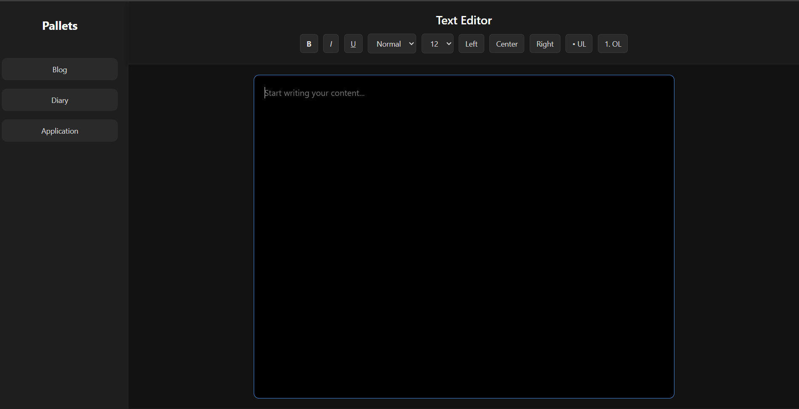

# React Text Editor (Assignment 3)

A modern dark-themed rich text editor built using React.
This project allows users to format selected text only, similar to editors like Notion or Medium.

---

## Features

* Editable text area using `contentEditable`
* Bold and Italic formatting (selected text only)
* Font size and heading styles
* Text alignment (left, center, right)
* Bullet (unordered) and numbered (ordered) lists
* Clean dark UI
* Sidebar + Header + Content layout
* Instant formatting without reload

---

## Project Structure

```plaintext
ASSIGN3/
│
├── src/
│   ├── components/
│   │   ├── Content.js
│   │   ├── Header.js
│   │   ├── Parent.js
│   │   ├── Sidebar.js
│   │   └── templates.js
│   │
│   └── main.js
│
├── index.html
├── style.css
├── package.json
├── package-lock.json
├── .gitignore
│
├── dist/
├── node_modules/
└── .parcel-cache/
```

---

## Tech Stack

* React
* CSS (Grid + Flexbox)
* DOM APIs:

  * `contentEditable`
  * `document.execCommand()`

---

## How It Works

* The editor uses a `div` with `contentEditable`
* Toolbar buttons trigger:

```js
document.execCommand(command)
```

* Formatting is applied only to selected text
* Layout is handled using CSS Grid

---

## Getting Started

### 1. Install dependencies

```bash
npm install
```

### 2. Run the project (Parcel)

```bash
npm start
```

### 3. Open in browser

http://localhost:1234

---

## Usage

1. Type text in the editor
2. Select any portion of text
3. Use toolbar:

   * B → Bold
   * I → Italic
   * Alignment buttons
   * Lists (bullet / numbered)
4. Only selected text will change

---

## Important Note

This project uses:

```js
document.execCommand()
```

* Easy to use
* Deprecated but still supported in modern browsers

Future upgrade options:

* Slate
* TipTap
* Draft.js

---

## Future Improvements

* Undo / Redo (Ctrl + Z)
* Save content (localStorage or backend)
* Drag and drop blocks (Notion-style)
* Pixel-based font sizing
* Image upload support

---

## Learning Outcomes

* Understanding of `contentEditable`
* Working with DOM selection
* Building UI with React and CSS Grid
* Creating a basic rich text editor

---

## License

This project is for learning purposes (Assignment 3).

## Screenshot of Project
